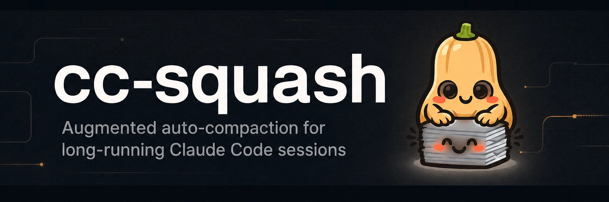
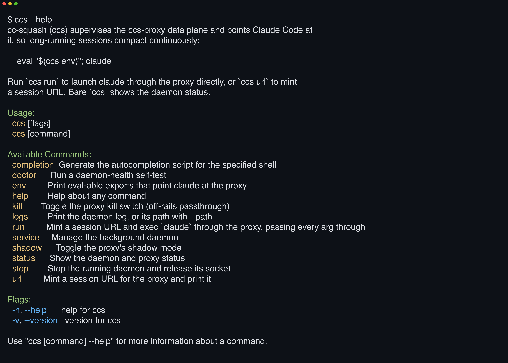

# 

**Compact ruthlessly. Regret nothing.** cc-squash proxies Claude Code's Anthropic traffic, prices every segment's keep-vs-evict call, and content-addresses each squash so anything evicted comes back.

[](https://github.com/yasyf/cc-squash/actions/workflows/ci.yml)
[](https://github.com/yasyf/cc-squash/releases)
[](LICENSE)

## Get started

```bash
brew install yasyf/tap/cc-squash
ccs run
```



`ccs run` starts the daemon on demand, mints a proxied session, and execs `claude` through it. cc-squash drops out of the process tree, and Claude runs exactly as before, minus the compaction cliff.

Driving with an agent? Paste this:

```text
Install cc-squash: `brew install yasyf/tap/cc-squash`, then `brew services start cc-squash`.
Run `ccs doctor` to verify the daemon, then `ccs shadow on` so the proxy logs what compaction would keep, summarize, and drop without touching live traffic.
Tell me to relaunch Claude Code as `ccs run` once the shadow ledger looks right.
Docs: https://github.com/yasyf/cc-squash#readme, plus `ccs <command> --help`.
```

---

## Use cases

### Keep a day-long session on thread past the auto-compact cliff

Claude Code compacts in one shot. The session hits a threshold, and the constraints you set, the decisions you argued out, and the files in flight all flatten into a single lossy summary. cc-squash compacts continuously instead:

```bash
ccs run
```

Every request gets repriced segment by segment on its way to Anthropic. Stale tool output squashes down to a placeholder; your constraints and decisions ride along verbatim, hours in.

### Pull any squashed file or tool result back mid-session

Compaction is normally a one-way door; whatever the summary dropped is gone. cc-squash content-addresses every squash into a local store first, and the placeholder it leaves behind tells the model how to reverse it:

```text
[cc-squash: squashed segment · ref=sha256:9f2b… · ~2050 tokens · 8210 bytes]
<one-line summary of the original>
Pull the full original if you need it:
  • retrieve("sha256:9f2b…")
```

`ccs run` registers the `cc_squash_retrieve` MCP tool automatically, so when the model needs the original bytes, it pulls them back itself, byte-for-byte, mid-session.

### Audit what compaction would drop before trusting it live

Handing your context window to a proxy on faith is a bad trade. Shadow mode computes the full squash plan for every live request and only logs it:

```bash
ccs shadow on
ccs logs
```

The daemon log shows what each request would have kept, summarized, and dropped, while the traffic itself passes through untouched. `ccs shadow off` goes live, and `ccs kill on` is the hard passthrough switch when you want cc-squash out of the loop entirely.

## Commands

Per-command flags live in `ccs <command> --help`.

| Command | What it does |
|---|---|
| `ccs run [claude args…]` | Mint a session and exec `claude` through the proxy; args pass through verbatim |
| `ccs env` | Print eval-able exports for shells that launch `claude` themselves |
| `ccs url` | Mint a session URL for `ANTHROPIC_BASE_URL=$(ccs url)` and print it |
| `ccs status` | Daemon and proxy status; bare `ccs` prints the same table, `--json` the raw snapshot |
| `ccs shadow on\|off` | Log-only mode that computes squash decisions without altering traffic |
| `ccs kill on\|off\|status` | Kill switch, raw passthrough with compaction off |
| `ccs doctor` | Daemon-health self-test |
| `ccs logs` | Print the daemon log, or its path with `--path` |
| `ccs stop` | Stop the daemon and release its socket |
| `ccs service install\|uninstall` | Manage the launchd agent; `brew services start cc-squash` works too |

## How it works

A Go control plane (`ccs`) supervises a Rust data plane (`ccs-proxy`) that sits at `ANTHROPIC_BASE_URL` and owns every `/v1/messages` body. Deterministic passes compress what survives losslessly; an economics model prices each remaining segment on what it costs to keep carrying versus what it costs to re-fetch, and evicted segments land content-addressed in a local SQLite ref store, replaced on the wire by the placeholder above. Squashes land at prompt-cache breakpoints, so compaction doesn't torch your cache hits.

cc-squash is early, at v0.1.x on macOS via Homebrew. The engine runs live; shadow mode exists so you don't have to take that claim on faith.

Licensed under [PolyForm Noncommercial 1.0.0](LICENSE).
